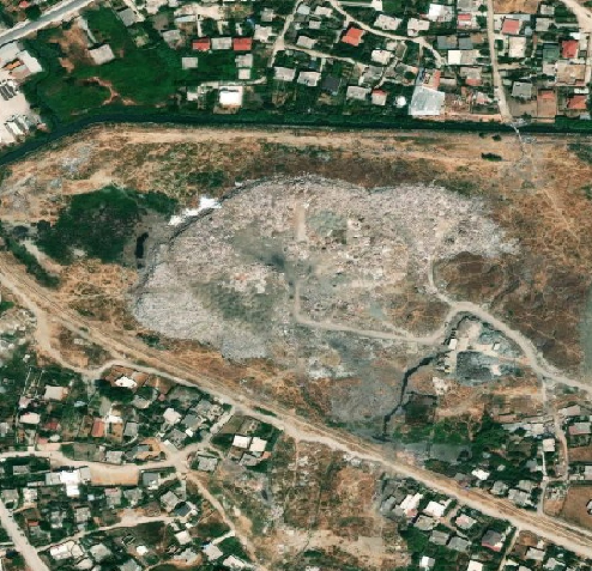

# Albania Waste Detection

Contacts: caleb@earthrise.media, glynis@earthrise.media

## Summary of Methods:

We have developed a system that analyzes satellite data to detect
aggregations of waste. To our knowledge, no operational monitoring
system for municipal solid waste exists. On land, the spectral diversity
of waste and land cover makes it challenging to devise spectral indices
that can effectively discriminate waste.

This system was developed for the Global Plastic Watch platform, which
targets the identification of plastic and municipal waste. With remote
detection of waste aggregations, one can measure rather than model waste
distributions and monitor waste site development through time, through a
globally consistent and comprehensive dataset. The outputs of the tool
can be seen at
[globalplasticwatch.org](https://globalplasticwatch.org/).

Our waste detection tool is composed of two convolutional neural
networks that analyze and combine spectral, spatial, and temporal
signals in Sentinel-2. The two networks work in tandem. Candidate
regions generated by the first that are then cross-validated by the
second. The first ingests per-pixel spectrograms, twelve-band spectra
concatenated across two time steps. This data structure leverages both
spectral and temporal patterns when assessing the likelihood that a
given pixel contains plastic waste. Candidate waste sites are then
generated via blob detection on the raster of positively-classified
pixels. A second neural network validates the candidate sites. This
secondary network operates on patches of raster data rather than
individual pixels, incorporating spatial context in its evaluations
along with the spectral and temporal data.

Points that are classified by both networks are denoted as \"candidate
sites.\" These candidates are then evaluated by a curator using
publicly-available high-resolution satellite data, Google Street View
imagery where available, and/or Planetscope data. This process has the
benefit of limiting the number of false positives. However, it is
imperfect. The high-resolution data is frequently older than the data
used for detection. Thus, a candidate waste site might be rejected if it
is newly created. Additionally, waste aggregations are not always
obvious to identify even in the high resolution images. Thus, some sites
are labeled as \"uncertain\" if the validator needs additional
information.

Full details of the system are detailed in the technical paper,
currently under review in Nature Scientific Reports, and available as a
[preprint on arXiv.org](https://arxiv.org/abs/2204.01485).

## Summary of Work:

In this analysis, we evaluated every 10 × 10m Sentinel-2 pixel captured
in all of Albania (2.87 × 10^4^ km^2^) at nine time steps between
January, 2019 and March, 2021. This produced 2.5 billion predictions at
the pixel level and 9.6 million classifications of patches. To reduce
variance, we average the time-step outputs to arrive at a final
assessment of the presence of waste.

Detection can be run in multiple configurations. We chose to run the
system in a high sensitivity configuration, which produces more false
positive results, but is also the most likely to identify waste. Though
the client region of interest is limited to the areas near Vlora and to
the south, we found it valuable to analyze the full country. Waste
pollution is frequently transported by rivers, thus a waste site located
outside of the study region may still contribute plastic pollution to
the target area of interest.

Following manual candidate validation using high-resolution imagery, we
were able to confirm the identification of 39 municipal waste sites and
13 industrial waste sites. Because construction waste is so visually and
spectrally similar to rocky terrain, it is challenging to confirm these
locations by visual inspection. We identified 49 of these sites that
could not be confirmed, but are likely construction waste candidates.

For each of these sites, we created a metadata profile capturing
geophysical and environmental parameters. These parameters are:

-   Distance to Nearest Waterway

-   Nearest Water Type

-   Drainage Direction

-   Height Above Nearest Drainage

-   Upstream Drainage Area

-   Elevation

-   Fine Earth Density

-   Landform Type

-   Population within 1, 5, and 10 km radii

-   Land Slope

-   Soil Clay Fraction

-   Soil Sand Fraction

-   Soil Great Group

-   Site Area

Based on these characteristics, we computed a risk score for each
confirmed municipal waste site. The risk index is a composite of:

-   site area (smaller is better)

-   distance to waterway (further is better)

-   population within 5 km (fewer is better)

-   percentage of clay in the soil (higher is better to avoid
    groundwater contamination)

The z-score for each variable is calculated at every site using the
population of all waste sites detected globally. Because all variables
other than clay % follow a log normal distribution, the log of the value
is taken before computing the z score. Distances to waterways are offset
by +10 meters in order to avoid taking a log of 0.

Mathematically, the risk score is expressed as:

Each parameter is weighted according to the methodology developed in
Widyarsana et al., 2019[^1].

## Outputs

The raw data containing the locations and metadata for each site type
provided as csv and GeoJSON files can be found at
[https://github.com/earthrise-media/albania-waste/tree/main/data](https://github.com/earthrise-media/albania-waste/tree/main/data)

The master data file is included in this report, and contains metadata
and locations for all three classes of waste sites. This file can also
be found at
[https://github.com/earthrise-media/albania-waste/blob/main/data/albania_all.csv](https://github.com/earthrise-media/albania-waste/blob/main/data/albania_all.csv)

We also created a set of tools for exploring the data. All site types
are displayed on an interactive map at
[https://earthrise-media.github.io/plastics/albania-waste-1.0](https://earthrise-media.github.io/plastics/albania-waste-1.0).
The sites can be filtered by any of the metadata parameters in order to
find sites of interest using the "filtering" tab.

For each detected site type, we also generated a display of high
resolution imagery for each site location. Each high-resolution tile is
shown with 30cm Mapbox imagery, and links to the corresponding location
in Google maps for inspection of surrounding areas.

-   Confirmed sites:
    [https://earthrise-media.github.io/albania-waste/albania-confirmed](https://earthrise-media.github.io/albania-waste/albania-confirmed)

-   Industrial sites:
    [https://earthrise-media.github.io/albania-waste/albania-industrial](https://earthrise-media.github.io/albania-waste/albania-industrial)

-   Uncertain candidates:
    [https://earthrise-media.github.io/albania-waste/albania-possible](https://earthrise-media.github.io/albania-waste/albania-possible)

We have also created a map of reported waste sites that combines
detections by our algorithm, data from OpenStreetMap, and data from the
Albanian Ministry of Tourism and the Environment.
[https://earthrise-media.github.io/albania-waste/albania-synthesis](https://earthrise-media.github.io/albania-waste/albania-synthesis)

## Recommendations

### Confirmed Detections

Based on the evaluation of risk scores, we have made a rough
determination of these three sites most likely to cause environmental
harm.

1.  [40.472°N,
    19.466°E](https://globalplasticwatch.org/map?site=8f1ed6a8c829a1b).
    Risk score, 0.31. The site is encroaching on a canal, has a large
    surface area, and has a population of nearly 9,000 nearby.

2.  [40.480°N,
    19.472°S](https://globalplasticwatch.org/map?site=8f1ed6aab576314).
    Risk score, 0.28. This site appears to be an informal dumping ground
    in the heart of Vlorë, with 11,000 people living within 1 km. It is
    also adjacent to a canal, which poses a plastic pollution transport
    risk.

3.  [40.424°N,
    19.493°S](https://earthrise-media.github.io/albania-waste/albania-synthesis#17.79/40.424063/19.492953).
    Quantitative risk score can not be computed as this is an
    unconfirmed site. Though the site can not be confirmed with
    certainty from the high resolution satellite imagery, this is quite
    likely to be a waste site. It is in a tourism-heavy district, and
    falls quite close to the coast.

### Unconfirmed Detections

There are a number of candidate sites within the region of interest that
the models identified, but could not be confirmed. It would be advisable
to prioritize on-the-ground validations of sites at the following
coordinates in addition to site \#3 listed above. Sites are listed in
order from north to south and link to their locations on a map.

-   [40.430,
    19.503](https://earthrise-media.github.io/albania-waste/albania-synthesis#17.9/40.429674/19.502884)

-   [40.396,
    19.481](https://earthrise-media.github.io/albania-waste/albania-synthesis#18.12/40.395683/19.480939)

-   [40.377,
    19.482](https://earthrise-media.github.io/albania-waste/albania-synthesis#18.26/40.377047/19.481827)

-   [40.369,
    19.497](https://earthrise-media.github.io/albania-waste/albania-synthesis#18.17/40.369362/19.496753)

-   [40.344,
    19.485](https://earthrise-media.github.io/albania-waste/albania-synthesis#17.79/40.344059/19.485413)

-   [40.330,
    19.473](https://earthrise-media.github.io/albania-waste/albania-synthesis#16.89/40.330127/19.474035)

-   [40.021,
    20.187](https://earthrise-media.github.io/albania-waste/albania-synthesis#16.45/40.021516/20.187874)

-   [40.136,
    19.717](https://earthrise-media.github.io/albania-waste/albania-synthesis#17.56/40.136069/19.718384)

-   [39.886,
    20.037](https://earthrise-media.github.io/albania-waste/albania-synthesis#17.17/39.885958/20.037524)

-   [39.844,
    20.034](https://earthrise-media.github.io/albania-waste/albania-synthesis#16.87/39.844653/20.035542)

[^1]: Widyarsana, I. Made Wahyu, et al. \"Risk assessment and
    rehabilitation potential of municipal solid waste landfills in Bali
    Province, Indonesia.\" *GEOMATE Journal* 17.63 (2019): 164-171.
